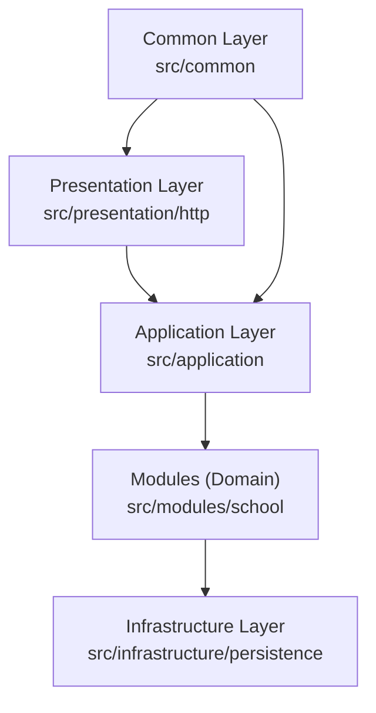

# BackToSchool Rust (Final Project)

โปรเจกต์งานจบระบบจัดการโรงเรียนด้วย Rust รองรับทั้ง `CLI` และ `REST API` พร้อมระบบ `login + role` และ export รายงานเป็น `CSV/PDF`

## จุดเด่น

- จัดการนักเรียน รายวิชา การลงทะเบียน และคะแนน
- ยืนยันตัวตนด้วย Bearer Token (`/login`)
- Authorization ตาม role: `admin`, `teacher`
- REST API ด้วย `axum`
- Export รายงานเป็น CSV/PDF
- แยกโครงสร้างโฟลเดอร์แบบ layer คล้าย NestJS
- มี unit tests สำหรับ logic สำคัญ

## Architecture (Diagram)



## โครงสร้างโปรเจกต์

```text
src/
  main.rs
  lib.rs
  common/
    cli.rs
  application/
    app.rs
  modules/
    school/
      models.rs
      report.rs
  infrastructure/
    persistence/
      school_db.rs
  presentation/
    http/
      server.rs
```

## เริ่มใช้งาน

```bash
cargo run -- --help
```

## CLI ตัวอย่าง

```bash
cargo run -- add-student S001 "Somchai"
cargo run -- add-course CS101 "Intro to Rust"
cargo run -- enroll S001 CS101
cargo run -- grade S001 CS101 87.5
cargo run -- report-student S001
cargo run -- report-course CS101
```

## รัน REST API

```bash
cargo run -- serve
```

กำหนด host/port เอง:

```bash
cargo run -- --addr 127.0.0.1:4000 serve
```

## บัญชีเริ่มต้น

- `admin` / `admin123` (admin)
- `teacher` / `teacher123` (teacher)

## ตัวอย่างเรียก API

1. Login เพื่อรับ token

```bash
curl -X POST http://127.0.0.1:3000/login \
  -H "Content-Type: application/json" \
  -d "{\"username\":\"teacher\",\"password\":\"teacher123\"}"
```

1. เรียก endpoint ที่ต้อง auth

```bash
curl http://127.0.0.1:3000/students \
  -H "Authorization: Bearer <TOKEN>"
```

1. Export รายงาน

```bash
# CSV
curl -L "http://127.0.0.1:3000/reports/student/S001/csv" \
  -H "Authorization: Bearer <TOKEN>" \
  -o student_S001.csv

# PDF
curl -L "http://127.0.0.1:3000/reports/student/S001/pdf" \
  -H "Authorization: Bearer <TOKEN>" \
  -o student_S001.pdf
```

## Endpoints

- `GET /health`
- `POST /login`
- `GET /students`
- `POST /students` (teacher/admin)
- `GET /courses`
- `POST /courses` (admin only)
- `POST /enroll` (teacher/admin)
- `POST /grade` (teacher/admin)
- `GET /reports/student/{student_id}`
- `GET /reports/course/{course_code}`
- `GET /reports/student/{student_id}/csv`
- `GET /reports/course/{course_code}/csv`
- `GET /reports/student/{student_id}/pdf`
- `GET /reports/course/{course_code}/pdf`

## รันทดสอบ

```bash
cargo test
```

## หมายเหตุ

- ค่าเริ่มต้นฐานข้อมูลคือ `school_db.json`
- เปลี่ยน path ได้ด้วย `--db` เช่น `cargo run -- --db my_school_data.json serve`
